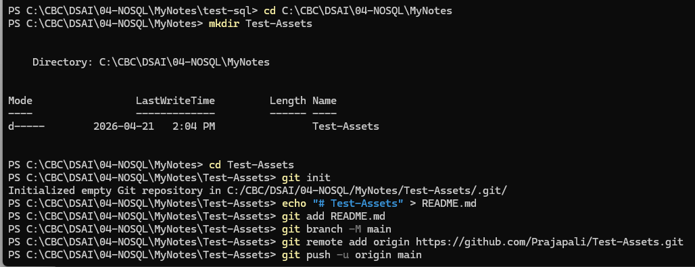

# Git Init to GitHub - Step by Step 

## 1. Go to working directory
cd C:\CBC\DSAI\04-NOSQL\MyNotes

## 2. Create project folder
mkdir Test-Assets
cd Test-Assets

## 3. Initialize Git
git init

## 4. Create README file
echo "# Test-Assets" > README.md

## 5. Stage file
git add README.md

## 6. Rename branch to main
git branch -M main

## 7. Connect to GitHub
git remote add origin https://github.com/Prajapali/Test-Assets.git

## 8. Commit changes
git commit -m "first commit"

## 9. Push to GitHub
git push -u origin main

---

## Summary Flow
init → add → commit → branch → remote → push

## Result
Your project will appear on GitHub with README file.

# git practice
## Init Command Screenshot

